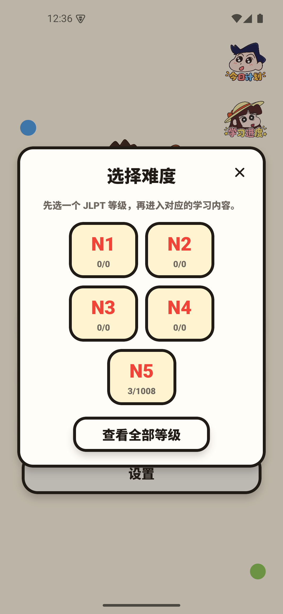
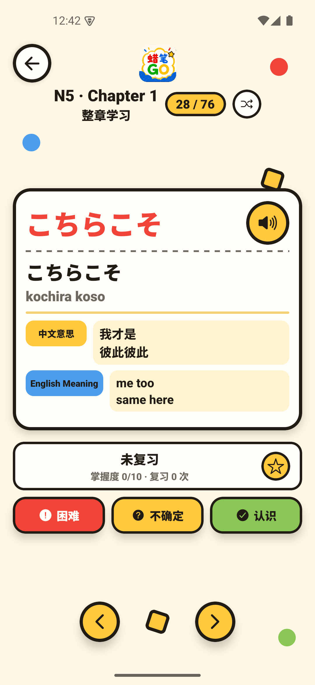
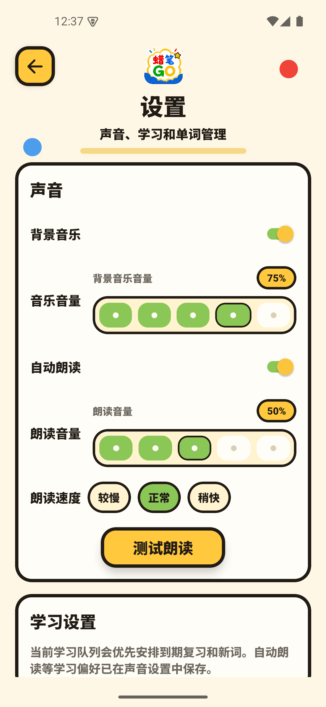

# 蜡笔GO

蜡笔GO is an Android-first React Native CLI app for offline Japanese vocabulary study. It focuses on JLPT vocabulary import, local review, Japanese pronunciation, and playful mobile UI polish without login, backend services, Firebase, or paid APIs.

## Screenshots

These screenshots are captured from the actual app UI, not mockups.

| Home | JLPT Selection | Study Screen | Settings |
| --- | --- | --- | --- |
|  |  |  |  |

## Features

### Learning

- JLPT N1-N5 learning flow with generated chapter and session navigation.
- Natural numeric sorting for Chapter and Session values while preserving the original imported text for display.
- Standard vocabulary study with previous/next navigation, shuffle, saved study position, and familiarity marking.
- Automatic Japanese pronunciation on word changes, plus a manual replay button.

### Practice Modes

- Flashcards for recall-based review.
- Multiple-choice practice for recognition.
- Typing practice for active recall.
- Kana drill for reading practice.

### Vocabulary & Review

- Offline CSV/TSV import with validation, duplicate detection, selected-level filtering, and clear result counts.
- Local vocabulary browser/search.
- Favorites, difficult-word review, and recent study activity.
- Level-specific clearing and full vocabulary reset from Settings.

### Progress

- Word-level progress stored locally.
- Daily study entry point.
- Study progress summaries and recent activity.
- Review metadata for mastery, correct/incorrect counts, difficult count, favorite status, and next review date.

### Audio & Settings

- Japanese TTS through `react-native-tts` using `ja-JP`.
- Pronunciation volume, pronunciation speed, and auto-pronunciation settings.
- Local BGM playback through an Android native MediaPlayer module.
- BGM enable/disable, BGM volume, looping, and ducking while pronunciation plays.

## Study Flow

1. Import a CSV or TSV vocabulary file from Settings.
2. Choose a JLPT level from the home screen.
3. Browse chapters and sessions generated from the actual imported database rows.
4. Study words in order, replay pronunciation, mark familiarity, favorite useful words, or review difficult words later.
5. Use the Study and Library areas for daily practice, search, recent activity, and alternate quiz modes.

## Tech Stack

| Area | Implementation |
| --- | --- |
| Mobile framework | React Native CLI `0.86.0`, React `19.2.3` |
| Language | TypeScript strict mode |
| Navigation | React Navigation native stack |
| Local database | `@op-engineering/op-sqlite` |
| Preferences | `@react-native-async-storage/async-storage` |
| Import | `@react-native-documents/picker`, Papa Parse, native file reader |
| Pronunciation | `react-native-tts` with `ja-JP` |
| BGM | Android native Kotlin MediaPlayer module with bundled raw MP3 resources |
| Animation | React Native built-in Animated API |
| UI support | React Native components, Safe Area Context, Screens, Gesture Handler, Vector Icons |
| Quality | Jest, React Native ESLint config, TypeScript checks |

## Architecture

The app keeps UI, navigation, persistence, and study logic separated in a small React Native structure. Screens own presentation state and call service/repository APIs. SQLite schema and queries live under `src/database`, CSV validation stays in the pure parser service, and audio behavior is split between a React provider, a speech service, and the Android native BGM module.

## Project Structure

```text
src/
  components/      Shared UI pieces such as cards, logo, mascot, buttons, and headers
  constants/       Theme colors, spacing, sizing, and app constants
  database/        SQLite schema, migrations, repository, and testable memory repository
  navigation/      Native stack route definitions
  providers/       App-level providers such as audio/BGM state
  screens/         Home, study, library, settings, chapter/session, and practice screens
  services/        CSV parser, speech, settings, native file reading, and study-session state
  types/           Shared TypeScript types
  utils/           Sorting, formatting, and study helpers
android/           Android native app, Gradle config, Kotlin BGM module, raw audio resources
image/             App images used by the React Native UI
bgm/               Source BGM audio files
docs/screenshots/  Real app screenshots for GitHub
__tests__/         Parser, repository, settings, progress, and practice-mode tests
```

## Local Development

Prerequisites:

- Node.js `>=22.11.0`
- npm
- Android Studio with Android SDK installed
- JDK 17 for Android release builds

Install dependencies:

```bash
npm install
```

Start Metro on the project port:

```bash
npm start
```

Run Android:

```bash
npm run android
```

Metro and Android scripts are configured to use port `8090`. Do not use `localhost:3000`, `localhost:8081`, or `localhost:8082` for this project.

## Checks

```bash
npm run typecheck
npm run lint
npm test -- --runInBand
```

## Building Android APK

### Debug APK

The debug build bundles JavaScript into the APK, so it can be installed without Metro.

```bash
cd android
gradlew.bat assembleDebug
```

Debug APK output:

```text
android/app/build/outputs/apk/debug/app-debug.apk
```

Install on a connected emulator or Android device:

```bash
adb install -r android/app/build/outputs/apk/debug/app-debug.apk
```

### Release Signing

Release builds use a local Android signing key. Passwords are read from `android/keystore.properties` or environment variables and are not hardcoded in Gradle files.

Generate a local release keystore only if you do not already have one:

```cmd
keytool -genkeypair -v ^
  -storetype PKCS12 ^
  -keystore android\app\shinchan-go-release.keystore ^
  -alias shinchan-go-key ^
  -keyalg RSA ^
  -keysize 2048 ^
  -validity 10000
```

Create `android/keystore.properties` locally:

```properties
MYAPP_UPLOAD_STORE_FILE=shinchan-go-release.keystore
MYAPP_UPLOAD_KEY_ALIAS=shinchan-go-key
MYAPP_UPLOAD_STORE_PASSWORD=<your local keystore password>
MYAPP_UPLOAD_KEY_PASSWORD=<your local key password>
```

Both `android/keystore.properties` and release keystore files are ignored by Git. Keep a secure backup of your keystore and passwords; losing them can prevent future updates under the same signing identity.

### Release APK

On Windows, use the Gradle wrapper:

```powershell
cd android
.\gradlew.bat clean
.\gradlew.bat assembleRelease
```

Release APK output:

```text
android/app/build/outputs/apk/release/app-release.apk
```

The release APK includes the React Native JavaScript bundle and local assets, so it does not require Metro.

## Data & Vocabulary

Vocabulary is imported by the user and persisted locally. The app does not require a backend account or network service for learning data.

## CSV/TSV Format

Required headers:

```text
jlpt_level,chapter,session,word,kana
```

Optional headers:

```text
prefix,suffix,romaji,meaning_zh,meaning_en,example_jp,example_zh,example_en
```

Import behavior:

- Supports CSV, TSV, UTF-8 BOM, CRLF/LF, quoted fields, commas inside fields, multiline fields, Chinese, Japanese, and English.
- Header order may change, but header names must match after trimming and lowercasing.
- `jlpt_level` accepts N1, N2, N3, N4, and N5.
- Rows with missing required values, invalid JLPT levels, selected-level mismatch, or duplicate vocabulary signatures are skipped and counted.
- The selected JLPT import level is never silently rewritten into mismatched CSV rows.

## SQLite Schema

Primary table: `vocabulary`

```sql
id INTEGER PRIMARY KEY AUTOINCREMENT
jlpt_level TEXT NOT NULL
chapter TEXT NOT NULL
session TEXT NOT NULL
prefix TEXT
word TEXT NOT NULL
suffix TEXT
kana TEXT NOT NULL
romaji TEXT
meaning_zh TEXT
meaning_en TEXT
example_jp TEXT
example_zh TEXT
example_en TEXT
import_order INTEGER NOT NULL
created_at TEXT NOT NULL
```

Progress table: `word_progress`

```sql
word_id INTEGER PRIMARY KEY
mastery TEXT NOT NULL
review_count INTEGER NOT NULL
correct_count INTEGER NOT NULL
incorrect_count INTEGER NOT NULL
difficult_count INTEGER NOT NULL
favorite INTEGER NOT NULL
last_reviewed TEXT
next_review TEXT
updated_at TEXT NOT NULL
```

Important indexes include JLPT level lookup, level/chapter/session lookup, progress review date lookup, and a unique vocabulary signature to prevent exact duplicate imports.

## Audio System

BGM is handled globally by `AudioProvider` and an Android Kotlin `BgmModule`, which plays bundled raw MP3 resources with Android MediaPlayer. Pronunciation is handled separately by `react-native-tts`; when speech starts, BGM is temporarily ducked and restored after speech finishes, is cancelled, or errors.

## Learning Features

### Standard Study

The main vocabulary flow displays one word at a time with kana, romaji, meanings, examples, favorite status, and review controls.

### Flashcards

Flashcard mode reuses the word study flow with reveal-style review behavior.

### Multiple Choice

Multiple-choice practice builds answer options from the selected practice source.

### Typing

Typing practice asks the learner to produce the answer directly.

### Kana

Kana drill focuses on reading recognition and is available from the study entry area.

## Project Status

This is a functional personal/portfolio React Native Android project. It has local persistence, tests, Android build configuration, real screenshots, and release signing support, but asset and data licensing should still be reviewed before a public or commercial release.

## Notes for Public Release

- This is an independent personal/portfolio project and is not official, sponsored, licensed, or affiliated with any entertainment property or rights holder.
- Review the license status of bundled artwork, BGM, and vocabulary data before public redistribution or commercial use.
- No open-source license has been selected yet. Until a license is added, all rights are reserved by default.
- Recommended GitHub topics: `react-native`, `typescript`, `android`, `japanese-learning`, `jlpt`, `flashcards`, `language-learning`, `sqlite`.
